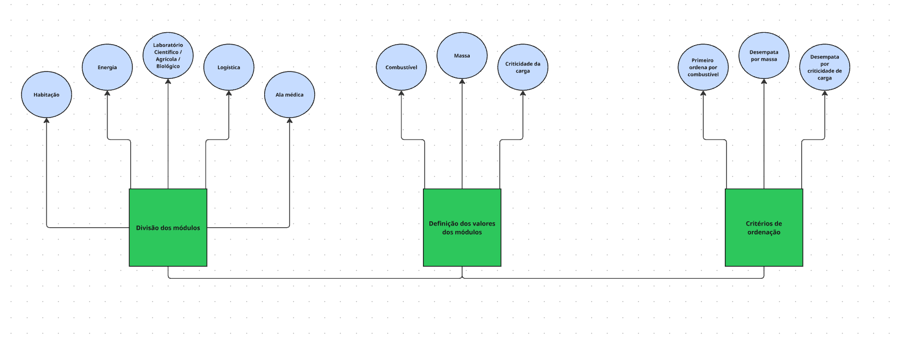

# 🚀🧑‍astronauta Missão Aurora Siger — MGPEB

Olá tripulação, aqui é o Astronauta Victor G. Mantovani, responsável pela criação da estrutura e escolha dos dados.

Espero que essa mensagem encontre vocês bem.

---

## 📊 Fluxograma

Esse foi o fluxograma criado para embasar a ideia da estrutura dos dados.

---

## 📦 Módulos

Separei todos os cinco módulos com os seguintes atributos:

- **ID** — identificador único do módulo (ex: MOD-01)
- **Tipo** — função do módulo na missão (habitacao, energia, laboratorial, logistico, medico)
- **Combustível** — nível atual em float (0.0 a 1.0), onde valores abaixo de 0.25 indicam estado crítico
- **Massa** — peso total em kg, incluindo estrutura e carga
- **Criticidade** — importância da carga de 1 a 5, onde 5 é insubstituível
- **Chegada à órbita** — tempo estimado em minutos até entrada na órbita marciana
- **Descrição** — resumo da função e conteúdo do módulo

---

## 🗂️ Estrutura de Dados

A fila principal de pouso segue a ordem de prioridade baseada no nível de combustível — **quem tem menos combustível pousa primeiro**.

Em caso de empate, os critérios de desempate são:
1. Massa (maior massa consome mais combustível em órbita)
2. Criticidade da carga (maior criticidade tem prioridade)

### Listas auxiliares

- **fila_de_pouso** — módulos aguardando autorização de pouso, ordenados por prioridade
- **modulos_pousados** — módulos que concluíram o pouso com sucesso
- **modulos_em_espera** — módulos aguardando condições favoráveis de pouso
- **modulos_em_alerta** — módulos em situação crítica (combustível abaixo de 0.25)

---

## ⚠️ Regras de Movimentação

| Condição | Lista de destino |
|----------|-----------------|
| Pouso autorizado e concluído | modulos_pousados |
| Área de pouso ocupada | modulos_em_espera |
| Combustível < 0.25 | modulos_em_alerta |

---

*Arquivo desenvolvido por Victor G. Mantovani — Arquitetura de Dados e Integração*